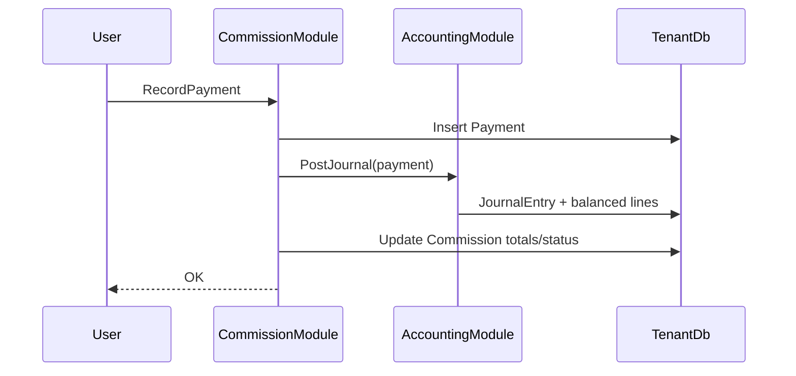

# Business Logic Model — Unit 5: Finance & Commission

## Architecture

```
CommissionModule / AccountingModule
        │
        ▼
   MediatR Handlers
        │
        ├── TenantDbContext (Commission + fees/payments/disputes)
        └── Journal posting service (Accounting)
```

Unit 4 `AddToCommission` remains the only shell creator. Unit 5 never auto-creates on Arrived.

---

## BL-C01: Commission queue (US-7.01)

```
GetCommissionBoardQuery(filters: status, office, country, search)
  1. List Commission rows (paginated)
  2. Join candidate summary (name, passport) via CandidateId
  3. Project TotalFees / TotalPaid / Balance / Status
  4. Default sort: Open/Partial/Disputed first, then OpenedAt desc
```

---

## BL-C02: Record fee breakdown (US-7.02)

```
UpsertCommissionFeesCommand(commissionId, fees[])
  1. Load Commission; assert not Settled (or allow adjust with audit — prefer block Settled)
  2. Replace or append fee lines (v1: replace-all for simplicity)
  3. Recalc TotalFeesAmount (Σ AmountEtb), BalanceAmount
  4. Recalc Status (Open/Partial/Settled) unless Disputed
  5. Save
```

---

## BL-C03: Record payment + journal (US-7.03)

```
RecordPaymentCommand(commissionId, amount, currency, method, paidAt, reference?, notes?)
  1. Load Commission; assert not Settled without open balance; block if no fees yet (recommended)
  2. Resolve ExchangeRate (currency→ETB) for PaidAt date (or 1.0 if ETB)
  3. Insert Payment (Amount, AmountEtb, rate)
  4. Begin transaction:
       a. Save Payment
       b. PostJournalForPayment:
            Dr Cash/Bank (1100) AmountEtb
            Cr Commission Revenue (4100) AmountEtb
            (alt: Dr AR / Cr Revenue on fee set; payment clears AR — v1 uses Cash↔Revenue)
       c. Link Payment.JournalEntryId
       d. Recalc TotalPaid / Balance / Status
  5. Commit; SignalR refresh commission board
```

**v1 posting policy:** Cash (or Bank) debit / Revenue credit for each payment. Fee breakdown is operational; AR optional later.

---

## BL-C04: Multi-currency (US-7.04)

```
GetExchangeRate(from, to=ETB, date) → latest EffectiveDate ≤ date
UpsertExchangeRateCommand (Accounting / admin permission)
  - Used by payment recording when Currency ≠ ETB
```

---

## BL-C05: Disputes (US-7.07)

```
OpenDisputeCommand(commissionId, reason)
  → Dispute Open; Commission.Status = Disputed

ResolveDisputeCommand(disputeId, resolutionNotes)
  → Dispute Resolved; recalc Commission status from balances
```

---

## BL-C06: Per-office reporting (US-7.08)

```
GetCommissionReportQuery(officeId?, from, to)
  → Aggregates by OfficeName snapshot: count, fees ETB, paid ETB, balance
  (API + simple UI table; not full BI)
```

---

## BL-A01: Seeded CoA + journal read

```
GetAccountsQuery — list seeded accounts (read-only UI optional)
GetJournalEntryById / list by SourceId (Payment)
EnsureDefaultChartOfAccountsAsync — idempotent tenant seed
```

---

## Deferred BL (not Unit 5 UI)

- Bank reconciliation (US-7.05)
- Financial statements (US-7.06)
- Tax calculations (US-7.09)

---

## Sequence: Payment


