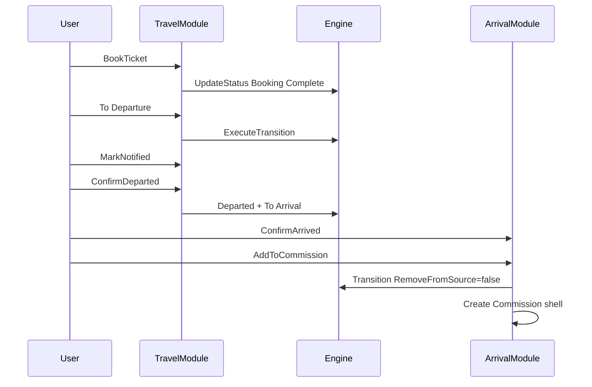
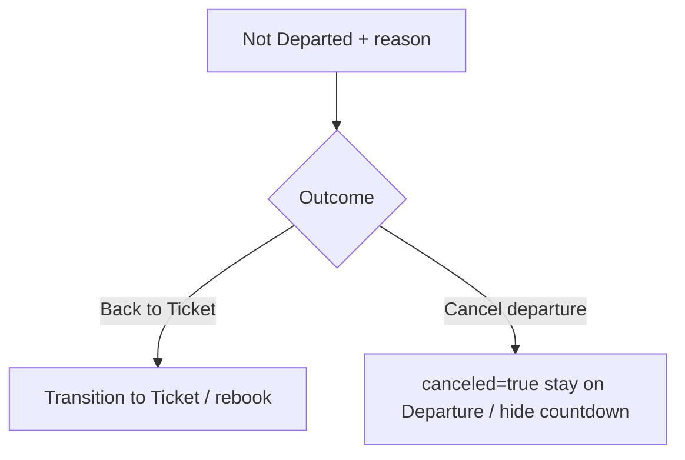

# Business Logic Model — Unit 4: Travel, Departure & Arrival

## Architecture note

```
TravelModule / ArrivalModule / ExceptionModule
        │
        ▼
   MediatR Handlers
        │
        ▼
 IWorkflowEngineService.UpdateStatus / ExecuteTransition / GetAvailableActions
        │
        ▼
 TenantDbContext (Candidate + WorkflowEvent + ExceptionCase + Commission)
```

Intent modules wrap the Unit 2 engine; exception + commission shells are domain side-effects after status/transition success.

---

## BL-T01: Book Ticket (US-5.01)

```
BookTicketCommand(candidateId, destination, flightDate, optional ticketRef)
  1. Assert CurrentStage = Ticket (or visible in Ticket)
  2. Assert destination, flightDate required
  3. UpdateStatus(track=ticket_status, to=Booking Complete,
       data={destination, flight_date, ticket_ref?})
  4. Denormalize destination, flight_date into CurrentStatusValues
  5. Emit CandidateStatusChanged → SignalR Ticket board
```

---

## BL-T02: Transfer to Departure (US-5.02)

```
ExecuteTransition("To Departure")
  1. Preconditions: Ticket + ticket_status = Booking Complete
  2. RemoveFromSource=true → leave Ticket
  3. Initialize Departure tracks: notification_status=Awaiting
  4. Emit CandidateStageChanged
```

---

## BL-T03: Departure board + Remaining Days (US-5.03)

```
GetDepartureBoardQuery
  1. Candidates where CurrentStage=Departure OR VisibleInStages contains Departure
  2. EXCLUDE where CurrentStatusValues.canceled = true
  3. Compute RemainingDays = flight_date.Date − UtcNow.Date
  4. Sort ascending by RemainingDays (urgent first)
  5. Columns: Name, Passport, Destination, FlightDate, RemainingDays,
     Notification, DepartureStatus, Office, Partner
```

---

## BL-T04: Mark Notified (US-5.05)

```
MarkNotifiedCommand(candidateId)
  1. Assert on Departure board (not canceled)
  2. Assert notification_status = Awaiting
  3. UpdateStatus(track=notification_status, to=Notified,
       data={notified_at=UtcNow})
  4. Bot send: stub / no-op (Unit 7)
  5. Emit CandidateStatusChanged
```

---

## BL-T05: Confirm Departed (US-5.06)

```
ConfirmDepartedCommand(candidateId)
  1. Assert on Departure, not canceled
  2. Assert notification_status = Notified (recommended gate — see BR)
  3. UpdateStatus(track=departure_status, to=Departed,
       data={departed_at=UtcNow})
  4. ExecuteTransition("To Arrival") RemoveFromSource=true
  5. Initialize Arrival status = Pending
  6. Emit stage + status events
```

---

## BL-T06: Not Departed → reason → outcome (US-5.07 / US-5.08)

```
RecordNotDepartedCommand(candidateId, reason, outcome)

  reason ∈ {MissedFlight, Immigration, Medical, CandidateNoShow, AirlineCancel, Other}
  outcome ∈ {BackToTicket, CancelDeparture}

  1. Assert on Departure, not already Departed, not canceled
  2. UpdateStatus(track=departure_status, to=Not Departed,
       data={non_departure_reason=reason, departure_outcome=…})

  IF outcome = BackToTicket:
     3a. Set departure_outcome=Rebooked
     4a. ExecuteTransition("Back to Ticket") RemoveFromSource=true
     5a. Reset ticket_status to Pending (or keep Booking Complete — prefer Pending for rebook)
     6a. Clear departure tracks for next cycle

  IF outcome = CancelDeparture:
     3b. Set departure_outcome=Canceled, canceled=true
     4b. NO transition — stay CurrentStage=Departure
     5b. GetDepartureBoard excludes this row (history still queryable via includeCanceled flag)
     6b. No To Arrival available

  7. Emit events; audit reason in WorkflowEvent
```

---

## BL-A01: Arrival board (US-6.01)

```
GetArrivalBoardQuery
  1. CurrentStage=Arrival OR VisibleInStages contains Arrival
  2. Permanent ledger — includes candidates also visible in Commission
  3. Columns: Name, Passport, Destination, Status, ArrivedAt, ExceptionFlag, Office
```

---

## BL-A02: Confirm Arrived (US-6.02)

```
ConfirmArrivedCommand(candidateId)
  1. Assert on Arrival
  2. Assert status = Pending
  3. UpdateStatus(arrival track / status → Arrived, data={arrived_at})
  4. Emit CandidateStatusChanged
```

---

## BL-A03: Flag Returned / Runaway (US-6.03)

```
FlagExceptionCommand(candidateId, type: Returned|Runaway)
  1. Assert on Arrival
  2. UpdateStatus → Returned | Runaway
  3. Create ExceptionCase(Open, type) if no open case exists
  4. Emit events; SignalR Arrival + Exception boards
```

---

## BL-A04: Add to Commission (US-6.06) — shell

```
AddToCommissionCommand(candidateId)
  1. Assert Arrival status = Arrived (not Returned/Runaway open without resolution — see BR)
  2. ExecuteTransition("Add to Commission") RemoveFromSource=false
  3. Upsert Commission shell (Status=Open) if none exists for candidate
  4. Snapshot CountryOfTravel, OfficeName, ContractDate from candidate
  5. Candidate remains on Arrival board forever
  6. Visible in Commission stage
```

---

## BL-X01: Exception workspace (US-6.04–US-6.05)

```
AddInvestigationNoteCommand(caseId, body)
UpdateExceptionStatusCommand(caseId, status)
AssignLiabilityCommand(caseId, party, amount, currency, notes?)
CloseExceptionCommand(caseId, resolutionSummary, financialImpact?)

  Investigation does not auto-change Arrival status.
  Closing case does not remove candidate from Arrival ledger.
```

---

## BL-X02: Exception list query

```
GetExceptionCasesQuery(filters: status, type, officeId?)
GetExceptionCaseByIdQuery(id) → case + notes + liabilities + candidate summary
```

---

## Sequence: Happy path Ticket → Commission



---

## Sequence: Not Departed fork


