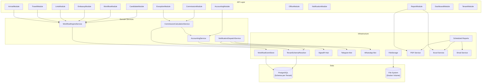

# Component Dependencies

## Dependency Matrix



## Communication Patterns

| From | To | Pattern | Description |
|------|----|---------|-------------|
| Carter Module | MediatR Handler | In-process (Send) | Synchronous request/response |
| Handler | Domain Service | In-process (method call) | Direct invocation |
| Handler | DbContext | In-process (EF Core) | Database access |
| Handler | Domain Event | In-process (publish) | Emit after persist |
| Domain Event | NotificationDispatch | In-process (async) | Fire-and-forget notification |
| Domain Event | SignalR Hub | In-process (IHubContext) | Real-time push |
| Domain Event | Commission Service | In-process (handler) | Financial side-effect |
| Telegram Bot | MediatR | In-process (Send) | Bot commands routed to pipeline |
| WhatsApp Webhook | MediatR | In-process (Send) | Bot commands routed to pipeline |
| SignalR Hub | Frontend | WebSocket | Real-time client updates |
| Frontend | API | HTTP/JSON | Standard REST API calls |
| Frontend | SignalR | WebSocket | Bi-directional real-time |
| Scheduled Reports | Email | SMTP | Report delivery |

## Data Flow: Tenant Isolation

```
HTTP Request (with JWT)
  → Middleware: Extract TenantId from JWT claims
  → TenantSchemaResolver: Map TenantId → schema name
  → DbContext.OnConfiguring: SET search_path TO '{schema}', public
  → All queries scoped to tenant schema automatically
  → Public schema accessible for: tenant metadata, system config, exchange rates
```

## Cross-Cutting Dependencies

| Concern | Implementation | All Components Use |
|---------|---------------|-------------------|
| Authentication | JWT Bearer middleware | Yes (except public endpoints) |
| Authorization | AuthorizationBehavior + WorkflowAuthorizationBehavior | All commands/queries |
| Audit (Write) | AuditBehavior (pipeline) | All mutations |
| Audit (Read) | IReadAuditService | Sensitive read operations |
| Tenant Isolation | TenantSchemaResolver + DbContext | All data access |
| Validation | ValidationBehavior + FluentValidation | All commands |
| Error Handling | GlobalExceptionHandler middleware | All requests |
| Performance | PerformanceLogBehavior | All requests |
| Real-time | Domain Events → SignalR | All write operations |

## Bounded Context Mapping

```
+-------------------+     Domain Events     +-------------------+
|   CANDIDATE &     |  ──────────────────>  |    FINANCE        |
|   WORKFLOW         |  CandidateArrived     |    (Accounting +  |
|   (Core Domain)   |  CommissionRequested   |     Commission)   |
+-------------------+                       +-------------------+
        |                                           |
        | Domain Events                             | Domain Events
        | CandidateStageChanged                     | PaymentRecorded
        v                                           v
+-------------------+                       +-------------------+
|  NOTIFICATION     |                       |     ERP           |
|  (Supporting)     |                       |  (Staff, Office,  |
|                   |                       |   Roles, Tenant)  |
+-------------------+                       +-------------------+
```

**Integration between bounded contexts is via domain events only** — no direct database joins or shared aggregates across contexts.
