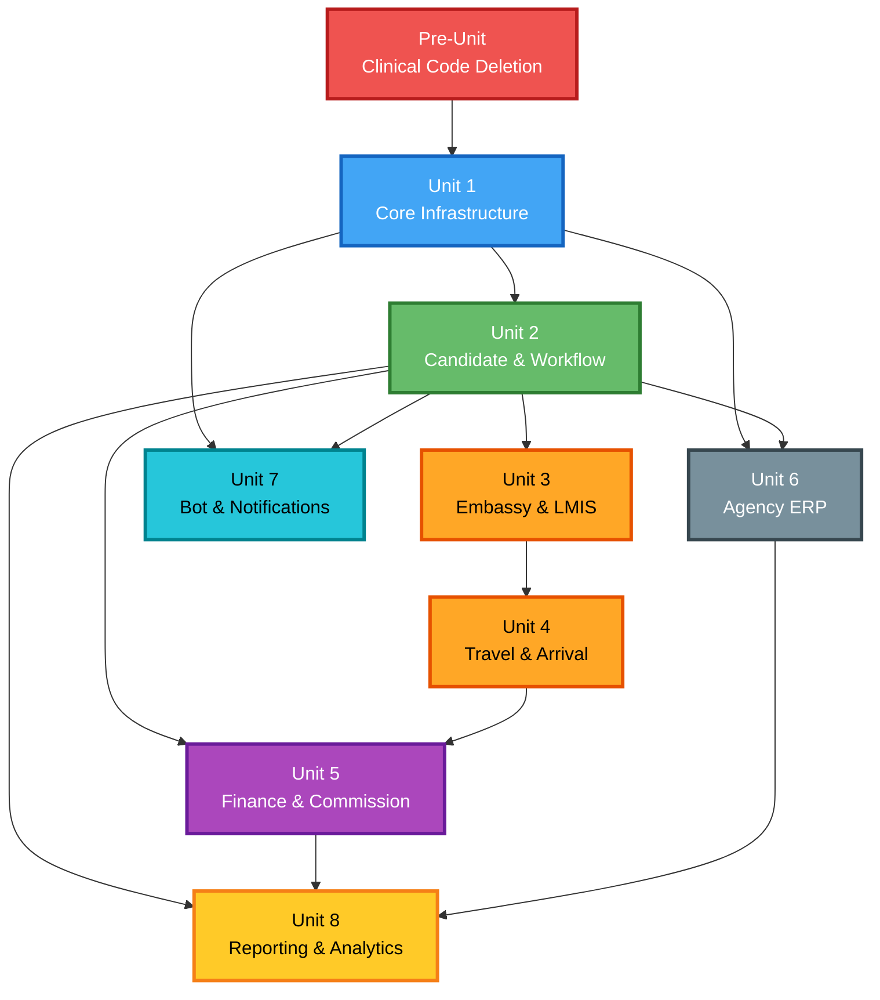

# Unit of Work Dependencies

## Dependency Graph



## Dependency Matrix

| Unit | Depends On | Depended By | Dependency Type |
|------|-----------|-------------|-----------------|
| Pre (Deletion) | — | U1 | Must complete first |
| U1 (Core Infra) | Pre | U2, U6, U7 | Foundation (schema, SignalR, Docker) |
| U2 (Candidate & Workflow) | U1 | U3, U4, U5, U6, U7, U8 | Core domain (all units use candidates/workflow) |
| U3 (Embassy & LMIS) | U2 | U4 | Workflow stages (LMIS → Ticket transition) |
| U4 (Travel & Arrival) | U2, U3 | U5 | Arrival triggers commission |
| U5 (Finance) | U2, U4 | U8 | Financial data for reports |
| U6 (Agency ERP) | U1, U2 | U8 | Office/staff data for reports |
| U7 (Bot & Notifications) | U1, U2 | — | Listens to all domain events |
| U8 (Reporting) | U2, U5, U6 | — | Aggregates data from all sources |

## Critical Path

```
Pre → U1 → U2 → U3 → U4 → U5 → (U6, U7, U8 can be parallel after U5)
```

**Strictly sequential execution** (per user decision), so actual order:
```
Pre → U1 → U2 → U3 → U4 → U5 → U6 → U7 → U8
```

## Integration Points Between Units

### U1 → U2: Infrastructure Contracts
- `ITenantSchemaResolver` — Unit 2 uses this to scope all queries
- `IFileStorageService` — Unit 2 uses for candidate document uploads
- `ISignalRNotificationService` — Unit 2 broadcasts candidate updates
- Docker Compose base config — Unit 2 adds migrations

### U2 → U3: Workflow Engine
- `IWorkflowEngineService` — Unit 3 uses to evaluate embassy/LMIS transitions
- `WorkflowEvent` table — Unit 3 appends embassy/LMIS-specific events
- Candidate queries — Unit 3 filters candidates by embassy/LMIS stage

### U2 → U5: Domain Events
- `CandidateArrived` event — Unit 5 listens to initialize commission
- `Candidate` entity — Unit 5 references for commission records
- `WorkflowEvent` stream — Unit 5 uses for audit trail of financial triggers

### U3 → U4: Stage Transitions
- "To Ticket" transition — Unit 4 receives candidates from LMIS stage
- Workflow configuration — Unit 4's stages defined in same workflow config

### U4 → U5: Financial Triggers
- `CandidateArrived` event — Triggers commission initialization
- `ExceptionResolved` event — Triggers financial adjustments
- `LiabilityAssigned` event — Creates accounting entries

### U1, U2 → U7: Event Broadcasting
- All domain events — Unit 7 listens to ALL events for notification dispatch
- SignalR hub — Unit 7 configures which events broadcast to which groups
- Candidate data — Bot uses for status lookups

### U2, U5, U6 → U8: Data Aggregation
- Candidate/Workflow data — Pipeline reports, overdue detection
- Financial data — Financial summary, commission reports
- Office data — Office comparisons, performance metrics

## Shared Resources

| Resource | Owner Unit | Consumers |
|----------|-----------|-----------|
| PostgreSQL (public schema) | U1 | All units |
| PostgreSQL (tenant schemas) | U1 | All units |
| SignalR Hub | U1 | U2-U8 (all broadcast through it) |
| File System Volume | U1 | U2 (documents), U8 (report exports) |
| WorkflowEngineService | U2 | U3, U4 (stage transitions) |
| Domain Event Dispatcher | U1 (existing) | U5, U7 (event consumers) |
| MediatR Pipeline | U1 (existing) | All units (all handlers) |
