# Execution Plan

## Detailed Analysis Summary

### Transformation Scope
- **Transformation Type**: Architectural Domain Pivot — Complete domain replacement while preserving infrastructure
- **Primary Changes**: Delete all clinical/medical domain code; rebuild with labour export domain entities, workflow engine, finance ERP, bot integration
- **Related Components**: All layers affected — Domain entities, API features, Infrastructure (DbContext, migrations, seeds), Frontend (pages, components, types, stores)

### Change Impact Assessment
- **User-facing changes**: Yes — Entire UI replaced with labour export views and workflow
- **Structural changes**: Yes — Multi-tenancy model changed (TenantId → schema-per-tenant), new SignalR hub, new bot service
- **Data model changes**: Yes — Complete schema replacement (drop clinical tables, create workflow/candidate/finance tables)
- **API changes**: Yes — All feature endpoints replaced with new domain endpoints
- **NFR impact**: Yes — SignalR real-time, schema-per-tenant isolation, double-entry accounting, bot integration

### Component Relationships
```
SimbaFlow.Domain (REBUILD)
  └── New entities: Candidate, WorkflowStage, WorkflowTransition, Embassy, LMIS, Ticket, Departure, Arrival, Commission, Account, JournalEntry, Office, PartnerAgency
  
SimbaFlow.Infrastructure (MAJOR CHANGES)
  ├── Persistence: New DbContext with schema-per-tenant, new migrations
  ├── Identity: Keep (JWT, MFA, sessions, password history)
  ├── Audit: Keep (write + read audit)
  ├── New: SignalR hub, Telegram bot service, WhatsApp bot service, Notification service, PDF generation service, Excel export service
  └── Scheduling: Remove (no appointment scheduling)

SimbaFlow.Application (MODERATE CHANGES)  
  ├── Keep: ValidationBehavior, AuthorizationBehavior, AuditBehavior, PerformanceBehavior, ConcurrencyBehavior
  ├── Replace: ClinicalAuthorizationBehavior → WorkflowAuthorizationBehavior
  └── Keep: Result<T>, PaginatedList, ICurrentUserService, IJwtTokenService, etc.

SimbaFlow.API (REBUILD FEATURES)
  ├── Keep: Extensions/ServiceExtensions (adapt), Middleware, Program.cs structure
  └── Replace: All Feature modules (Auth stays, everything else new)

Frontend (MAJOR CHANGES)
  ├── Keep: Auth flow, layout shell, UI components (shadcn), API proxy pattern
  └── Replace: All pages, feature components, types, stores
```

### Risk Assessment
- **Risk Level**: High — Full domain replacement with architectural additions (schema-per-tenant, SignalR, bot)
- **Rollback Complexity**: Moderate — Git branch-based rollback available
- **Testing Complexity**: Complex — Workflow engine state machine, multi-tenancy isolation, financial accounting correctness

## Workflow Visualization

```mermaid
flowchart TD
    Start(["User Request"])
    
    subgraph INCEPTION["INCEPTION PHASE"]
        WD["Workspace Detection<br/>COMPLETED"]
        RE["Reverse Engineering<br/>COMPLETED"]
        RA["Requirements Analysis<br/>COMPLETED"]
        US["User Stories<br/>COMPLETED"]
        WP["Workflow Planning<br/>COMPLETED"]
        AD["Application Design<br/>EXECUTE"]
        UG["Units Generation<br/>EXECUTE"]
    end
    
    subgraph CONSTRUCTION["CONSTRUCTION PHASE"]
        FD["Functional Design<br/>EXECUTE (per-unit)"]
        NFRA["NFR Requirements<br/>EXECUTE (per-unit)"]
        NFRD["NFR Design<br/>EXECUTE (per-unit)"]
        ID["Infrastructure Design<br/>EXECUTE (per-unit)"]
        CG["Code Generation<br/>EXECUTE (per-unit)"]
        BT["Build and Test<br/>EXECUTE"]
    end
    
    Start --> WD --> RE --> RA --> US --> WP --> AD --> UG
    UG --> FD --> NFRA --> NFRD --> ID --> CG
    CG -->|Next Unit| FD
    CG --> BT --> End(["Complete"])

    style WD fill:#4CAF50,stroke:#1B5E20,stroke-width:3px,color:#fff
    style RE fill:#4CAF50,stroke:#1B5E20,stroke-width:3px,color:#fff
    style RA fill:#4CAF50,stroke:#1B5E20,stroke-width:3px,color:#fff
    style US fill:#4CAF50,stroke:#1B5E20,stroke-width:3px,color:#fff
    style WP fill:#4CAF50,stroke:#1B5E20,stroke-width:3px,color:#fff
    style AD fill:#FFA726,stroke:#E65100,stroke-width:3px,stroke-dasharray: 5 5,color:#000
    style UG fill:#FFA726,stroke:#E65100,stroke-width:3px,stroke-dasharray: 5 5,color:#000
    style FD fill:#FFA726,stroke:#E65100,stroke-width:3px,stroke-dasharray: 5 5,color:#000
    style NFRA fill:#FFA726,stroke:#E65100,stroke-width:3px,stroke-dasharray: 5 5,color:#000
    style NFRD fill:#FFA726,stroke:#E65100,stroke-width:3px,stroke-dasharray: 5 5,color:#000
    style ID fill:#FFA726,stroke:#E65100,stroke-width:3px,stroke-dasharray: 5 5,color:#000
    style CG fill:#4CAF50,stroke:#1B5E20,stroke-width:3px,color:#fff
    style BT fill:#4CAF50,stroke:#1B5E20,stroke-width:3px,color:#fff
    style INCEPTION fill:#BBDEFB,stroke:#1565C0,stroke-width:3px,color:#000
    style CONSTRUCTION fill:#C8E6C9,stroke:#2E7D32,stroke-width:3px,color:#000
    style Start fill:#CE93D8,stroke:#6A1B9A,stroke-width:3px,color:#000
    style End fill:#CE93D8,stroke:#6A1B9A,stroke-width:3px,color:#000
```



## Phases to Execute

### INCEPTION PHASE
- [x] Workspace Detection (COMPLETED)
- [x] Reverse Engineering (COMPLETED)
- [x] Requirements Analysis (COMPLETED)
- [x] User Stories (COMPLETED)
- [x] Workflow Planning (IN PROGRESS)
- [ ] Application Design - **EXECUTE**
  - **Rationale**: New components needed (workflow engine, finance ERP, bot services, notification hub). Service layer design required. Component methods and business rules need definition.
- [ ] Units Generation - **EXECUTE**
  - **Rationale**: System decomposes into multiple units of work for parallel development. Complex system requiring structured breakdown into implementable units.

### CONSTRUCTION PHASE (Per-Unit Loop)
- [ ] Functional Design - **EXECUTE** (per-unit)
  - **Rationale**: New data models, complex business logic (workflow state machine, double-entry accounting), business rules need detailed design.
- [ ] NFR Requirements - **EXECUTE** (per-unit)
  - **Rationale**: Performance requirements exist (real-time, 500ms response). Security extensions enforced. Resiliency baseline enforced. PBT framework selection required.
- [ ] NFR Design - **EXECUTE** (per-unit)
  - **Rationale**: NFR patterns need incorporation (SignalR, schema-per-tenant, circuit breakers, rate limiting).
- [ ] Infrastructure Design - **EXECUTE** (per-unit)
  - **Rationale**: Docker Compose deployment, file storage volumes, PostgreSQL schema-per-tenant mapping, SignalR configuration.
- [ ] Code Generation - **EXECUTE** (ALWAYS, per-unit)
  - **Rationale**: Implementation of all modules.
- [ ] Build and Test - **EXECUTE** (ALWAYS)
  - **Rationale**: Build verification, unit tests, integration tests, PBT tests.

### OPERATIONS PHASE
- [ ] Operations - PLACEHOLDER
  - **Rationale**: Deployment documentation captured in Build and Test. Future expansion.

## Stages Skipped
- **None** — All conditional stages execute due to system complexity and scope.

## Module Update Strategy (Brownfield Pivot)

### Deletion Phase (First)
1. Delete all clinical/medical domain entities
2. Delete all clinical API feature modules
3. Delete all clinical frontend pages/components
4. Delete clinical-specific migrations (create fresh)

### Build Phase (Sequential by Dependency)
1. **Domain Layer** — New entities, enums, domain events (foundation — no dependencies)
2. **Infrastructure Layer** — DbContext, schema-per-tenant, migrations, new services
3. **Application Layer** — New interfaces, updated behaviors
4. **API Layer** — New feature modules (Carter)
5. **Frontend** — New pages, components, types, stores
6. **Bot Service** — Telegram/WhatsApp integration

### Unit Execution Order (Construction Phase)
Units will be determined in Units Generation, but the expected breakdown:
1. **Core Infrastructure** — Schema-per-tenant, updated auth, base workflow engine
2. **Candidate & Workflow** — Candidate CRUD + configurable workflow engine
3. **Embassy & LMIS** — Embassy processing + LMIS milestone tracking
4. **Travel & Arrival** — Ticketing + departure + arrival + exception handling
5. **Finance & Commission** — Double-entry accounting + commission tracking
6. **ERP & Admin** — Staff, offices, partners, roles, dashboard
7. **Bot & Notifications** — Telegram/WhatsApp + SignalR real-time
8. **Reporting** — Reports, exports, scheduled reports

## Success Criteria
- **Primary Goal**: Complete, deployable labour export agency management system
- **Key Deliverables**:
  - Working Docker Compose deployment
  - All 10 feature modules operational
  - Configurable workflow engine with default 8-stage template
  - Multi-tenancy with schema isolation
  - Real-time updates via SignalR
  - Telegram/WhatsApp bot with multi-language
  - Double-entry accounting with financial statements
  - Comprehensive reporting with Excel/PDF export
- **Quality Gates**:
  - All security extension rules pass
  - All resiliency extension rules pass (applicable to self-hosted)
  - Property-based tests for workflow state machine and financial calculations
  - Example-based tests for all critical paths
  - Zero TypeScript build errors (remove `ignoreBuildErrors` flag)
