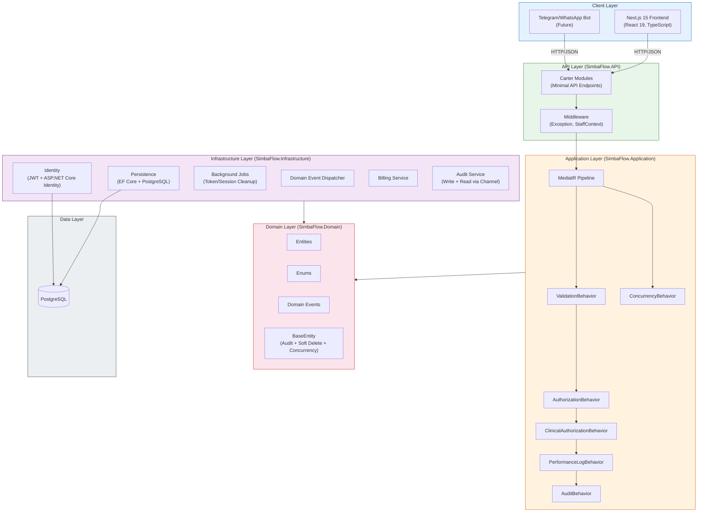
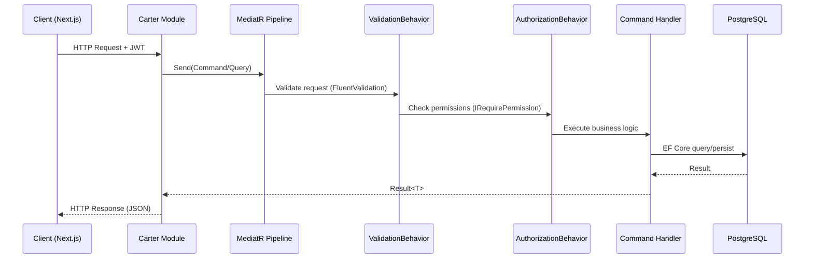

# System Architecture

## System Overview

SimbaFlow follows **Clean Architecture** with a vertical-slice feature organization in the API layer. The system uses **CQRS** (Command Query Responsibility Segregation) via MediatR for all business operations, with a robust pipeline of cross-cutting behaviors.

## Architecture Diagram

## Component Descriptions

### SimbaFlow.API (Web Host)
- **Purpose**: ASP.NET Core Minimal API host with Carter module registration
- **Responsibilities**: HTTP endpoint routing, DI configuration, middleware pipeline, OpenAPI docs, CORS, health checks
- **Dependencies**: Application, Infrastructure, Shared
- **Type**: Application (Web API)

### SimbaFlow.Application (Business Orchestration)
- **Purpose**: Cross-cutting pipeline behaviors and interface contracts
- **Responsibilities**: Request validation (FluentValidation), RBAC enforcement, clinical authorization, performance logging, audit capture, optimistic concurrency
- **Dependencies**: Domain
- **Type**: Application (Library)

### SimbaFlow.Domain (Core Business)
- **Purpose**: Pure domain model with no external dependencies
- **Responsibilities**: Entity definitions, enum types, domain events, base entity patterns
- **Dependencies**: None
- **Type**: Model (Library)

### SimbaFlow.Infrastructure (External Concerns)
- **Purpose**: Implements all interfaces defined in Application layer
- **Responsibilities**: EF Core DbContext, Identity/JWT services, background jobs, event dispatching, billing calculations, audit persistence
- **Dependencies**: Application, Domain
- **Type**: Infrastructure (Library)

### SimbaFlow.Shared (Shared Models)
- **Purpose**: DTOs and models shared across boundaries
- **Dependencies**: None
- **Type**: Shared (Library)

## Data Flow — Typical Request

## Integration Points

### External APIs
- **None currently** — self-contained system

### Databases
- **PostgreSQL** — Primary data store (EF Core + Npgsql)

### Third-party Services
- **None currently** — JWT auth is self-issued

## Infrastructure Components

### Deployment Model
- Single deployable .NET web application
- PostgreSQL database (single instance)
- Next.js frontend (separate deployment)

### Security
- JWT Bearer authentication with refresh token rotation
- ASP.NET Core Identity for user/role management
- Permission-based authorization (SuperAdmin bypass)
- Clinical authorization (department affiliation checks)
- IP restriction support (per-user CIDR allowlists)
- MFA (TOTP) support
