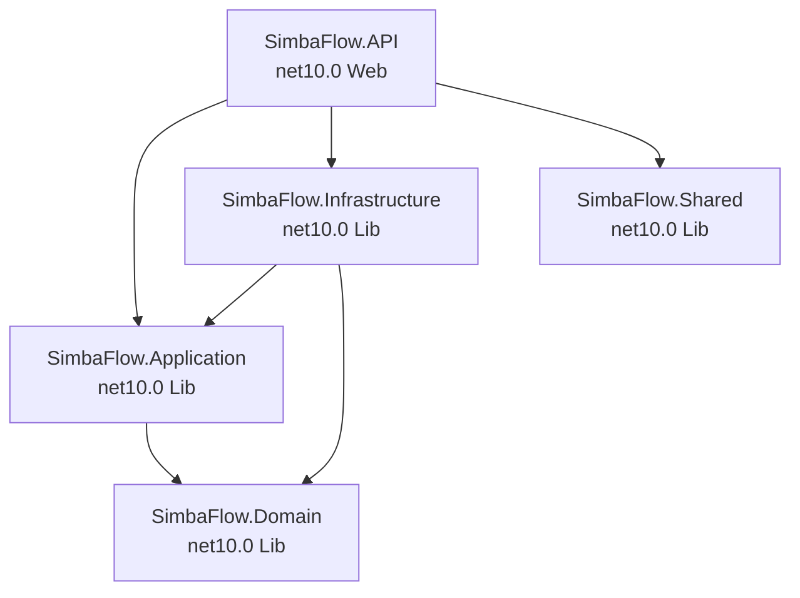

# Code Structure

## Build System
- **Type**: .NET SDK (MSBuild via .slnx solution)
- **SDK Version**: .NET 10.0.203 (global.json with latestFeature rollForward)
- **Solution File**: `backend/SimbaFlow.slnx`
- **Frontend Build**: Next.js (npm/Turbopack)

## Project Dependency Graph



## Design Patterns

### CQRS (Command Query Responsibility Segregation)
- **Location**: All feature modules (API layer)
- **Purpose**: Separate read and write operations for clear intent
- **Implementation**: MediatR `IRequest<Result<T>>` for commands, `IRequest<Result<List<T>>>` for queries

### Vertical Slice Architecture
- **Location**: `SimbaFlow.API/Features/{FeatureName}/`
- **Purpose**: Each feature is self-contained with its own commands, queries, validators, handlers
- **Implementation**: Carter modules group endpoints; commands/queries co-located with handlers

### Pipeline Behaviors (Decorator Pattern)
- **Location**: `SimbaFlow.Application/Common/Behaviors/`
- **Purpose**: Cross-cutting concerns without polluting business logic
- **Implementation**: MediatR `IPipelineBehavior<TRequest, TResponse>` chain

### Repository Pattern (Implicit)
- **Location**: `IApplicationDbContext` interface
- **Purpose**: Abstract data access behind interface
- **Implementation**: EF Core DbContext exposed as interface; handlers query directly via DbSets

### Domain Events
- **Location**: `BaseEntity.DomainEvents`, `IDomainEventDispatcher`
- **Purpose**: Decouple side effects from primary operations
- **Implementation**: Events collected during SaveChanges, dispatched after commit

### Result Pattern
- **Location**: `Result<T>` / `Result` in Application.Common.Models
- **Purpose**: Explicit success/failure without exceptions for flow control
- **Implementation**: Static factory methods `Success(data)` / `Failure(error, statusCode)`

### Soft Delete
- **Location**: `BaseEntity.IsDeleted`
- **Purpose**: Never physically delete data, maintain audit trail
- **Implementation**: Flag set on delete; queries filter `!IsDeleted`

### Optimistic Concurrency
- **Location**: `BaseEntity.RowVersion` (PostgreSQL xmin)
- **Purpose**: Prevent lost updates without pessimistic locks
- **Implementation**: EF Core concurrency token mapped to PostgreSQL system column

## Key Feature Structure (Pattern for Each Module)

```
Features/{ModuleName}/
  {ModuleName}Module.cs          -- Carter module (endpoint definitions)
  Commands/
    {Action}Command.cs           -- Command record + handler
    {Action}Validator.cs         -- FluentValidation rules
  Queries/
    Get{Entity}Query.cs          -- Query record + handler + response DTO
```

## Existing Files Inventory (Backend — Key Files)

### API Layer
- `Program.cs` — App startup, DI, middleware pipeline, seed data
- `Extensions/ServiceExtensions.cs` — All DI registrations (Carter, MediatR, Identity, CORS, Auth policies)
- `Middleware/GlobalExceptionHandler.cs` — Centralized error handling
- `Features/Auth/AuthModule.cs` — Login, refresh, logout, MFA, profile
- `Features/Patients/PatientModule.cs` — Patient CRUD, admit, discharge
- `Features/ClinicalWorkspace/ClinicalWorkspaceModule.cs` — Encounters, vitals, notes, diagnoses, alerts
- `Features/Scheduling/SchedulingModule.cs` — Appointments, availability, calendar
- `Features/Orders/OrdersModule.cs` — CPOE (diagnostic + medication orders)
- `Features/Laboratory/LaboratoryModule.cs` — Lab queue, results, verification
- `Features/Imaging/ImagingModule.cs` — Radiology queue, reports
- `Features/Pharmacy/PharmacyModule.cs` — Dispensation, inventory, formulary
- `Features/Billing/BillingModule.cs` — Charges, payments, chargemaster, invoices
- `Features/Inpatient/BedBoardModule.cs` — Bed board, ward census, transfers
- `Features/Staff/StaffModule.cs` — Staff profiles, provisioning, privileges
- `Features/Users/` — User management
- `Features/Roles/` — Role management
- `Features/Locations/` — Location CRUD
- `Features/Departments/` — Department CRUD
- `Features/DiagnosisCodes/` — ICD code reference
- `Features/MedicalHistory/` — Allergies, conditions, medications, surgeries
- `Features/Reports/` — Reporting module

### Application Layer
- `Common/Behaviors/ValidationBehavior.cs` — FluentValidation pipeline
- `Common/Behaviors/AuthorizationBehavior.cs` — Permission enforcement
- `Common/Behaviors/ClinicalAuthorizationBehavior.cs` — Department affiliation
- `Common/Behaviors/AuditBehavior.cs` — Audit logging pipeline
- `Common/Behaviors/PerformanceLogBehavior.cs` — Slow query detection
- `Common/Behaviors/ConcurrencyBehavior.cs` — Optimistic concurrency handling
- `Common/Interfaces/IApplicationDbContext.cs` — DbContext contract
- `Common/Interfaces/ICurrentUserService.cs` — Current user resolution
- `Common/Interfaces/IJwtTokenService.cs` — Token generation
- `Common/Interfaces/IRefreshTokenService.cs` — Refresh token management
- `Common/Interfaces/IAuditService.cs` — Audit logging
- `Common/Interfaces/IStaffContext.cs` — Staff profile resolution
- `Common/Models/Result.cs` — Result<T> pattern
- `Common/Models/PaginatedList.cs` — Pagination wrapper

### Domain Layer
- `Common/BaseEntity.cs` — Audit + soft delete + concurrency + domain events
- `Entities/Identity/ApplicationUser.cs` — User entity (Identity + security policies)
- `Entities/Identity/ApplicationRole.cs` — Role entity
- `Entities/Identity/Permission.cs` — Permission entity
- `Entities/Identity/RolePermission.cs` — Role-Permission junction
- `Entities/Identity/Department.cs` — Department entity
- `Entities/Identity/RefreshToken.cs` — Refresh token entity
- `Entities/Identity/UserSession.cs` — Session tracking
- `Entities/Identity/TenantInfo.cs` — Multi-tenancy
- `Entities/Staff/StaffProfile.cs` — Staff clinical identity
- `Entities/Locations/Location.cs` — Hierarchical locations
- `Entities/Patient.cs` — Patient entity
- `Entities/Clinical/` — Encounter, vitals, notes, diagnoses, alerts
- `Entities/Scheduling/` — Appointments, schedule blocks, shifts
- `Entities/Orders/` — Diagnostic/medication orders, lab results
- `Entities/Pharmacy/` — Stock, batches, dispensation
- `Entities/Billing/` — Charges, payments, insurance

### Infrastructure Layer
- `Persistence/ApplicationDbContext.cs` — EF Core context with audit hooks
- `Persistence/DependencyInjection.cs` — Infrastructure DI registration
- `Persistence/Seeds/` — Data seeders (permissions, roles, test data)
- `Identity/JwtTokenService.cs` — JWT generation
- `Identity/RefreshTokenService.cs` — Refresh token management
- `Identity/CurrentUserService.cs` — HTTP context user resolution
- `Identity/StaffContextMiddleware.cs` — Staff profile resolution middleware
- `Identity/PasswordHistoryValidator.cs` — Password reuse prevention
- `Audit/AuditService.cs` — Write audit implementation
- `Audit/ReadAuditService.cs` — Read audit (Channel-based async)
- `BackgroundJobs/TokenCleanupService.cs` — Expired token cleanup
- `BackgroundJobs/SessionCleanupService.cs` — Stale session cleanup
- `DomainEvents/DomainEventDispatcher.cs` — Event dispatch after save
- `Billing/EncounterChargeService.cs` — Auto-charge capture

### Frontend (Key Structure)
- `app/(auth)/` — Login, change-password pages
- `app/(main)/layout.tsx` — Authenticated shell with sidebar
- `app/(main)/overview/` — Dashboard landing
- `app/(main)/patients/` — Patient registry + detail
- `app/(main)/clinical/` — Clinical workspace + encounter detail
- `app/(main)/billing/` — Billing page
- `app/(main)/pharmacy/` — Pharmacy queue + inventory
- `app/(main)/imaging/` — Radiology queue
- `app/(main)/lab-results/` — Lab results
- `app/(main)/orders/` — Orders queue
- `app/(main)/(admin)/` — Admin pages (staff, roles, departments, appointments)
- `app/api/proxy/` — Backend API proxy routes
- `components/ui/` — shadcn/ui design system
- `lib/` — Utilities, API client, auth helpers
- `types/` — TypeScript type definitions
- `stores/` — Zustand state stores
