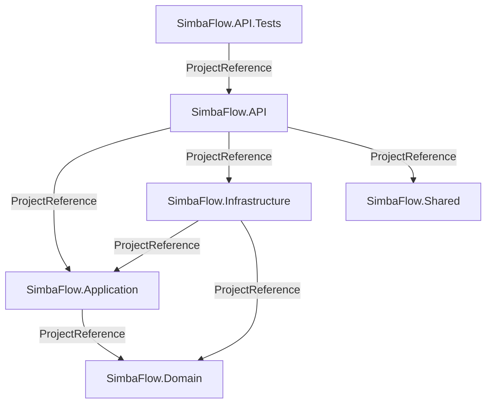

# Dependencies

## Internal Dependencies

### SimbaFlow.API depends on:
- **SimbaFlow.Application** (Compile) — Interfaces, behaviors, models
- **SimbaFlow.Infrastructure** (Compile) — DI registration, concrete services
- **SimbaFlow.Shared** (Compile) — Shared DTOs

### SimbaFlow.Infrastructure depends on:
- **SimbaFlow.Application** (Compile) — Implements interfaces defined here
- **SimbaFlow.Domain** (Compile) — Entity types for EF Core mapping

### SimbaFlow.Application depends on:
- **SimbaFlow.Domain** (Compile) — References entity types in interface definitions

## External Dependencies (Backend)

### SimbaFlow.API

| Package | Version | Purpose | License |
|---------|---------|---------|---------|
| Carter | 9.0.0 | Minimal API module registration | MIT |
| MediatR | 13.0.0 | CQRS mediator | Apache-2.0 |
| FluentValidation.DependencyInjectionExtensions | 12.0.0 | Validation DI | Apache-2.0 |
| Mapster | 7.4.0 | Object mapping | MIT |
| Microsoft.AspNetCore.Authentication.JwtBearer | 10.0.9 | JWT auth middleware | MIT |
| Microsoft.AspNetCore.OpenApi | 10.0.9 | OpenAPI generation | MIT |
| Microsoft.OpenApi | 2.7.5 | OpenAPI models (security pin) | MIT |
| Microsoft.EntityFrameworkCore.Design | 10.0.9 | EF Core migration tooling | MIT |
| Scalar.AspNetCore | 2.16.10 | API docs UI | MIT |
| AspNetCore.HealthChecks.NpgSql | 9.0.0 | PostgreSQL health check | Apache-2.0 |

### SimbaFlow.Infrastructure

| Package | Version | Purpose | License |
|---------|---------|---------|---------|
| Microsoft.AspNetCore.Authentication.JwtBearer | 10.0.9 | JWT token validation | MIT |
| Microsoft.AspNetCore.Identity.EntityFrameworkCore | 10.0.9 | Identity + EF Core integration | MIT |
| Microsoft.EntityFrameworkCore.Tools | 10.0.9 | EF Core CLI tools | MIT |
| Microsoft.IdentityModel.Tokens | 8.11.0 | Token signing/validation | MIT |
| Npgsql.EntityFrameworkCore.PostgreSQL | 10.0.2 | PostgreSQL EF Core provider | PostgreSQL |
| System.IdentityModel.Tokens.Jwt | 8.11.0 | JWT creation | MIT |

## External Dependencies (Frontend)

### Production Dependencies (Key)

| Package | Version | Purpose |
|---------|---------|---------|
| next | 15.2.4 | React framework |
| react / react-dom | ^19 | UI library |
| next-auth | ^4.24.11 | Authentication |
| zod | 3.25.67 | Schema validation |
| swr | ^2.3.6 | Data fetching |
| zustand | latest | State management |
| @tanstack/react-table | ^8.21.3 | Data tables |
| @radix-ui/* | Various | UI primitives |
| react-hook-form | ^7.60.0 | Forms |
| recharts | 2.15.4 | Charts |
| @fullcalendar/* | ^6.1.19 | Calendar |
| framer-motion | ^12.23.19 | Animations |
| lucide-react | ^0.454.0 | Icons |
| date-fns | 4.1.0 | Date utilities |

### Dev Dependencies

| Package | Version | Purpose |
|---------|---------|---------|
| tailwindcss | ^4.1.9 | CSS framework |
| @tailwindcss/postcss | ^4.1.9 | Tailwind PostCSS plugin |
| postcss | ^8.5 | CSS processing |
| typescript | ^5 | Type checking |
| @types/react | ^19 | React type definitions |
| @types/node | ^22 | Node.js type definitions |
| cross-env | ^7.0.3 | Cross-platform env vars |
| tw-animate-css | 1.3.3 | Animation utilities |

## Dependency Health Notes

1. **All packages are current** (July 2026) — no known vulnerable versions
2. **Microsoft.OpenApi pinned to 2.7.5** — explicit security patch (GHSA-v5pm-xwqc-g5wc)
3. **Frontend uses latest/caret ranges** for zustand, immer, sonner — consider pinning for production
4. **No lock file visible** — verify package-lock.json or pnpm-lock.yaml exists
