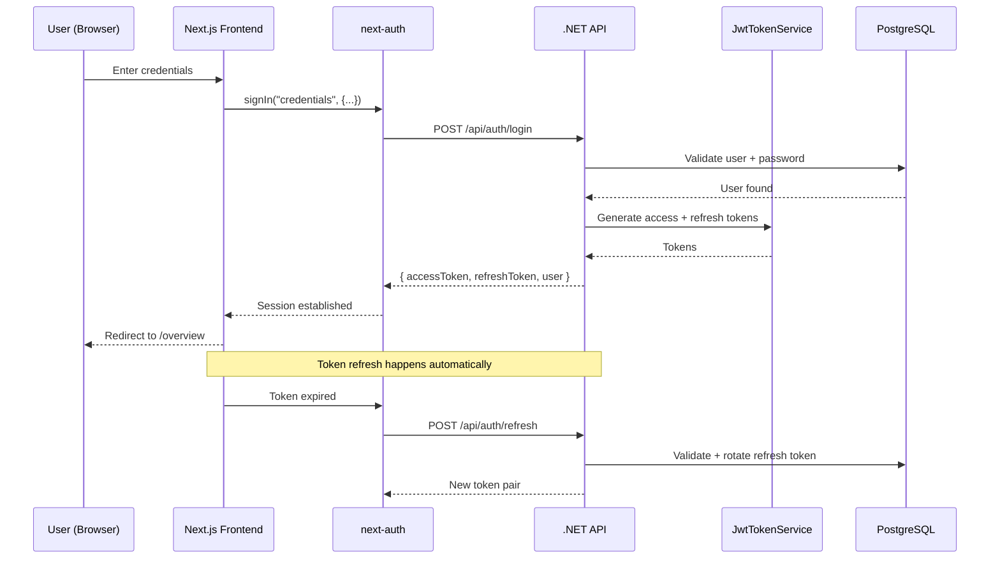
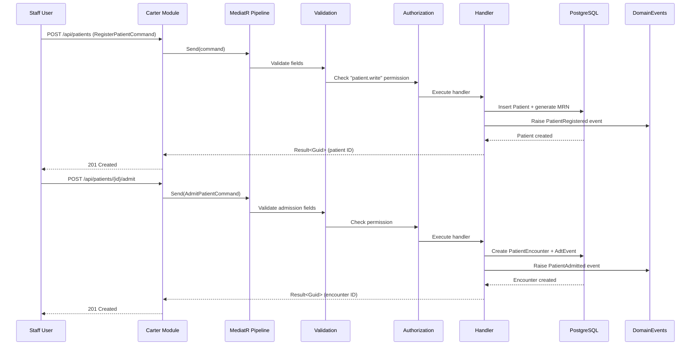
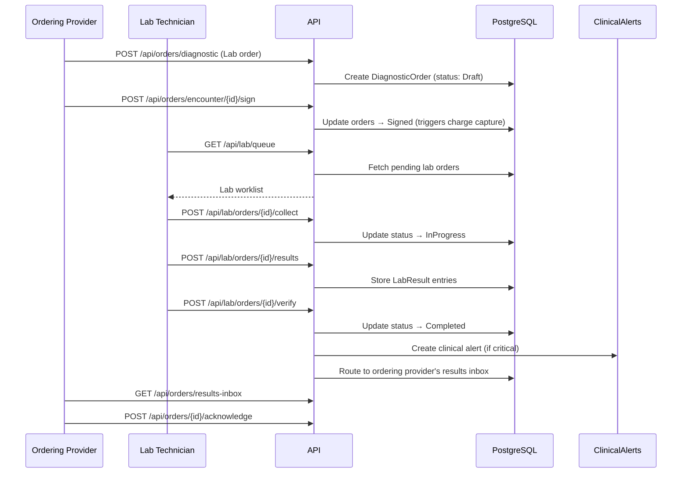
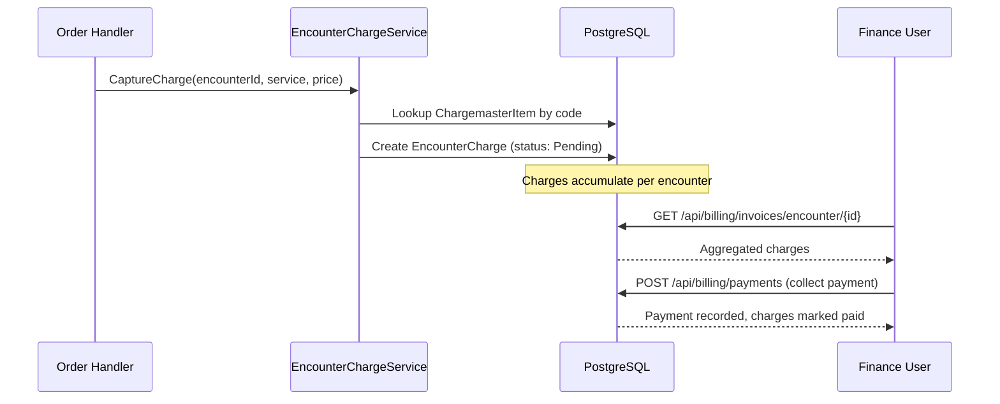
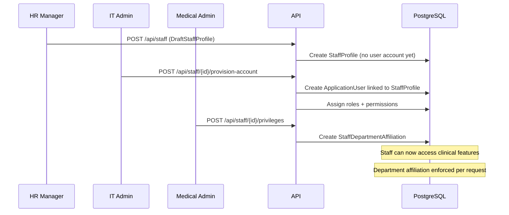

# Interaction Diagrams

## Key Business Transaction Flows

### 1. User Authentication Flow

### 2. Patient Registration → Admission Flow (Analogous to Candidate Registration)

### 3. Order → Lab Fulfillment Flow (Analogous to Workflow Stage Transitions)

### 4. Billing Auto-Capture Flow (Analogous to Commission Tracking)

### 5. Staff Lifecycle Flow (Directly Reusable)

### 6. Request Pipeline (Every Request)

```mermaid
flowchart LR
    REQ["HTTP Request"]
    JWT["JWT Validation"]
    STAFF["StaffContext<br/>Middleware"]
    CARTER["Carter<br/>Module"]
    MEDIATR["MediatR<br/>Send()"]
    VAL["Validation<br/>Behavior"]
    AUTHZ["Authorization<br/>Behavior"]
    CLIN["Clinical Auth<br/>Behavior"]
    PERF["Performance<br/>Behavior"]
    AUD["Audit<br/>Behavior"]
    HAND["Handler"]
    DB[("PostgreSQL")]

    REQ --> JWT --> STAFF --> CARTER --> MEDIATR
    MEDIATR --> VAL --> AUTHZ --> CLIN --> PERF --> AUD --> HAND --> DB

    style VAL fill:#FFF3E0
    style AUTHZ fill:#FFECB3
    style CLIN fill:#FFF9C4
    style PERF fill:#F1F8E9
    style AUD fill:#E8F5E9
```

## Patterns Applicable to Labour Export Workflow

The **Order → Lab Fulfillment** pattern directly maps to the SimbaFlow labour export workflow:

| Hospital Pattern | Labour Export Equivalent |
|-----------------|------------------------|
| Place Order | Register Candidate |
| Sign Order | Move to New Contract View |
| Collect Specimen | Book Medical / Tasheer |
| Enter Results | Update Medical Fit / Tasheer Done |
| Verify Results | Visa Issued |
| Route to Provider | Transfer to next view (LMIS, Ticket, etc.) |
| Acknowledge | Confirm Arrival |
| Auto-charge | Add to Commission |

The **pipeline behavior pattern** maps to:
- `AuthorizationBehavior` → Office/branch access control
- `ClinicalAuthorizationBehavior` → **WorkflowAuthorizationBehavior** (can user act on this stage?)
- `AuditBehavior` → Unchanged (audit all transitions)
- `ValidationBehavior` → Validate workflow transition rules
